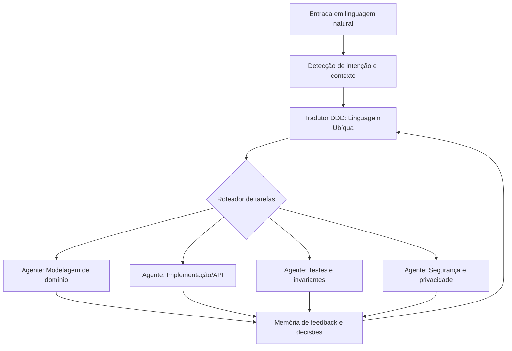
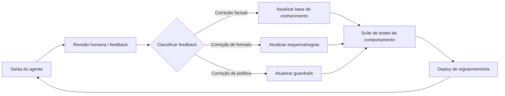
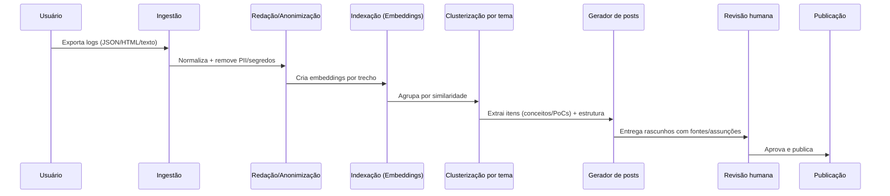

# Posts de blog gerados a partir do histórico disponível das conversas

## Resumo executivo

Este relatório transforma o que está **disponível nesta sessão** em um conjunto de **posts prontos para publicação**, com foco em arquitetura de software e IA aplicada a produto: (a) um **orquestrador de agentes** que traduz linguagem natural em **Linguagem Ubíqua (DDD)** e distribui tarefas, (b) um mecanismo de “**neuroplasticidade**” entendido como **ciclo de melhoria contínua via feedback**, e (c) uma **PoC para minerar logs de conversas** e gerar posts com rastreabilidade, privacidade e conformidade (LGPD). A base conceitual de DDD (Linguagem Ubíqua e *Bounded Context*) é tratada com fontes oficiais e primárias, incluindo documentação da Microsoft sobre DDD e análise de domínio para microserviços. citeturn0search1turn0search5

Como **não há acesso automático a sessões antigas** nesta conversa, este material cobre apenas itens explicitamente presentes aqui. Onde detalhes faltam (por exemplo, quais PoCs reais foram implementadas em chats anteriores), eu **explicito lacunas**, evito inferências indevidas e proponho caminhos objetivos para completar o inventário com segurança.

## Disponibilidade do histórico e lacunas

Não tenho acesso, a partir desta conversa, ao conteúdo de **múltiplas sessões passadas** (outros chats) que você menciona. Logo, está **faltando**: a lista completa de conceitos discutidos anteriormente, datas de cada discussão, decisões de design que tenham sido tomadas, trechos de código que tenham sido compartilhados, e quaisquer PoCs já implementadas/iteradas em sessões anteriores.

Histórico efetivamente analisado aqui:
- O seu pedido atual para “deep research” e geração de posts (incluindo requisitos de estrutura, SEO e uso de Mermaid).
- A instrução embutida para um **orquestrador de agentes** que traduz linguagem natural em **linguagem ubíqua (DDD)** e “aprende” com correções repetidas via ciclo de refinamento (interpretado como melhoria contínua por feedback).

Dados sensíveis: nesta sessão **não aparece** nenhum dado pessoal sensível, segredo, credencial, identificador governamental, ou conteúdo que exija redação. Se, ao incorporar conversas antigas, surgirem dados pessoais, a recomendação é **minimização e redação** antes de indexar/gerar conteúdo — alinhado a boas práticas de segurança e à própria LGPD. citeturn1search0turn1search1turn3search3turn3search11

## Metodologia e critérios de priorização

A “extração” de itens foi feita por leitura direta do que está disponível e síntese orientada por: (i) impacto potencial no seu blog (clareza, reutilização, relevância prática), (ii) viabilidade de implementar como PoC com componentes existentes (orquestração, memória/feedback, indexação por embeddings), e (iii) risco (privacidade, vazamento em logs, governança). A priorização “alta/média/baixa” pondera valor prático versus custo/complexidade e risco.

Para fundamentar conceitos técnicos e recomendações, este relatório privilegia fontes oficiais/primárias: documentação da Microsoft sobre DDD em microserviços e análise de domínio, documentação oficial do Mermaid, legislação oficial (Planalto) e guia da ANPD, além de documentação oficial da entity["organization","OpenAI","api platform"] para *tool calling*, *structured outputs* e embeddings. citeturn0search1turn0search5turn0search6turn0search22turn1search0turn1search1turn2search0turn2search1turn2search2

## Tabela de posts

| Title | Theme | Date discussed | Priority |
|---|---|---:|---|
| Orquestrador de agentes com DDD: traduzindo linguagem natural em Linguagem Ubíqua | Arquitetura de agentes + DDD | 2026-04-03 | Alta |
| “Neuroplasticidade” em sistemas de agentes: feedback, memória e melhoria contínua | Qualidade, governança e evolução | 2026-04-03 | Média |
| PoC: minerando logs de conversas para gerar posts com rastreabilidade e privacidade (LGPD) | Knowledge mining + compliance | 2026-04-03 | Alta |

## Posts prontos para publicar

**Tema: Arquitetura de agentes + DDD**

**Post:** Orquestrador de agentes com DDD: traduzindo linguagem natural em Linguagem Ubíqua

**Resumo executivo (2–4 frases).**  
Traduzir requisitos em “texto livre” para uma **Linguagem Ubíqua** consistente é um dos gargalos mais caros em produtos com domínio complexo. Este post descreve uma arquitetura de orquestração de agentes que converte linguagem natural em artefatos de DDD (glossário, comandos/eventos, invariantes e limites de contexto) e distribui tarefas para agentes especializados. A proposta se apoia em conceitos centrais de DDD como *Bounded Context* e Linguagem Ubíqua — esta última como vocabulário compartilhado entre domínio e engenharia. citeturn0search5turn0search4turn0search1

**Contexto e motivação.**  
Documentação, código e conversas frequentemente usam termos diferentes para o mesmo conceito (“cliente”, “comprador”, “titular”, “account”), criando ambiguidade e bugs semânticos. Em DDD, a Linguagem Ubíqua é justamente a prática de construir um idioma comum e rigoroso entre pessoas de negócio e desenvolvedores, baseado no modelo de domínio. citeturn0search4turn0search12  
Além disso, DDD trata problemas por domínios e delimita áreas independentes como *Bounded Contexts* — muitas vezes alinháveis a serviços/microserviços na prática de arquitetura moderna. citeturn0search1turn0search5

**Descrição detalhada da ideia/PoC.**  
A ideia é um **orquestrador** que recebe uma solicitação em linguagem natural e produz dois resultados acoplados:

1) **Artefatos de linguagem e domínio**: glossário do contexto, sinônimos proibidos, definições canônicas, comandos/eventos e regras/invariantes. Isso força consistência do vocabulário em documentação e código (ex.: métodos com nomes explícitos na linguagem do domínio, não “SetStatus(3)”). citeturn0search13turn0search9  

2) **Plano de execução multiagente**: tarefas para agentes especializados (modelagem, API, persistência, testes, segurança), com retorno estruturado e rastreável.

O mecanismo central é “tradução para linguagem ubíqua por contexto”: a mesma palavra pode significar coisas diferentes em contextos diferentes; por isso, a saída deve sempre declarar o *Bounded Context* e restringir o vocabulário àquele contexto. citeturn0search5turn0search1

Fluxo sugerido (alto nível):


citeturn0search5turn2search4turn2search0

**Passos de implementação (com snippets).**  
A forma mais robusta de manter rastreabilidade é exigir **saídas estruturadas**. Em APIs modernas de LLMs, isso costuma ser feito com JSON Schema e/ou *tool calling*. Em particular, *tool calling* segue um fluxo multi-passos (modelo sugere ferramenta → aplicação executa → retorna resultado → modelo finaliza). citeturn2search0turn2search1turn2search3

1) **Defina o contrato do “Tradutor DDD”** (JSON Schema). Ele deve retornar: `boundedContext`, `glossario`, `entidades`, `comandos`, `eventos`, `regras`, `termosProibidos`, `perguntasEmAberto`.

```json
{
  "type": "object",
  "required": ["boundedContext", "glossario", "eventos", "regras", "perguntasEmAberto"],
  "properties": {
    "boundedContext": { "type": "string" },
    "glossario": {
      "type": "array",
      "items": {
        "type": "object",
        "required": ["termo", "definicao", "sinonimos", "exemplos"],
        "properties": {
          "termo": { "type": "string" },
          "definicao": { "type": "string" },
          "sinonimos": { "type": "array", "items": { "type": "string" } },
          "exemplos": { "type": "array", "items": { "type": "string" } }
        }
      }
    },
    "eventos": { "type": "array", "items": { "type": "string" } },
    "regras": { "type": "array", "items": { "type": "string" } },
    "perguntasEmAberto": { "type": "array", "items": { "type": "string" } }
  }
}
```
citeturn2search1turn3search2

2) **Roteie para agentes especializados**: cada agente consome a Linguagem Ubíqua e retorna uma entrega (ex.: contrato de API, testes, ADR). Para ambientes com ferramentas, use *tools/function calling* para executar tarefas (ex.: gerar esqueleto de projeto, rodar testes, abrir PR). citeturn2search0turn2search4turn2search3

3) **Imponha consistência na modelagem**: entidades e agregados devem preservar invariantes e expor métodos expressivos na linguagem do domínio (evitando “setters” indiscriminados). citeturn0search13turn0search9

**Aplicações e limitações.**  
Aplicações: descoberta de domínio e alinhamento com stakeholders; geração de contratos e eventos; criação de backlog “semântico” (histórias/épicos alinhados ao glossário). citeturn0search5turn0search1  
Limitações: se o domínio estiver mal definido, o orquestrador não “inventa” verdade; ele explicita **perguntas em aberto**. Além disso, há risco de “congelar” a linguagem cedo demais — Linguagem Ubíqua evolui, então o pipeline deve suportar revisão versionada. citeturn0search12turn0search4

**Próximos passos e recursos.**  
Como próximo passo prático, rode workshops para acelerar descoberta de domínio (por exemplo, EventStorming), e alimente o tradutor com os resultados (glossário e eventos). citeturn3search1turn3search5  
Referências essenciais sobre DDD aplicado: guias da Microsoft sobre microserviços + DDD e análise de domínio. citeturn0search1turn0search5

**Títulos SEO sugeridos.**  
- “Do requisito ao código: um orquestrador de agentes guiado por DDD”  
- “Linguagem Ubíqua na prática: arquitetura de agentes para reduzir ambiguidade”  
- “Multiagentes + DDD: como transformar conversas em modelos de domínio”

**Meta description (≤160 chars).**  
“Arquitetura de orquestração de agentes que traduz linguagem natural em Linguagem Ubíqua (DDD) e gera tarefas rastreáveis para modelar e implementar.”

**Tags (3–5).**  
DDD; Linguagem Ubíqua; Arquitetura de Software; Agentes de IA; Microserviços


**Tema: Qualidade, governança e evolução**

**Post:** “Neuroplasticidade” em sistemas de agentes: feedback, memória e melhoria contínua

**Resumo executivo (2–4 frases).**  
Quando alguém pede que um sistema “aprenda com correções repetidas”, o requisito real costuma ser: capturar feedback, transformá-lo em regra operacional e impedir regressões. Este post propõe um desenho de “neuroplasticidade” para sistemas de agentes: um ciclo de avaliação + memória curada, com rastreio de decisões e testes de comportamento. A base é tratar o agente como um sistema que alterna “raciocinar” e “agir” (com ferramentas), alinhado à literatura de modelos que intercalam pensamento e ações para reduzir alucinação e erro em cascata. citeturn1search2turn2search0turn2search4

**Contexto e motivação.**  
Na prática, sistemas de agentes falham por três motivos: (1) não lembram decisões anteriores, (2) lembram “qualquer coisa” sem curadoria, ou (3) incorporam feedback sem avaliação e pioram outras tarefas. A abordagem “ReAct” descreve um padrão em que o modelo intercala raciocínio e ações, melhorando rastreabilidade e correção ao consultar fontes externas em vez de “inventar” resposta. citeturn1search2turn1search11

**Descrição detalhada da ideia/PoC.**  
Aqui, “neuroplasticidade” é uma metáfora útil para três mecanismos concretos:

1) **Memória declarativa curada**: um repositório versionado de decisões (glossário, preferências de estilo, restrições, exceções). Essa memória não é “tudo que foi dito”, mas o que foi **validado** como regra.  
2) **Memória episódica com retenção mínima**: logs de execução e justificativas, com expiração/anonimização, para depurar e auditar — evitando armazenamento excessivo de dados. Boas práticas de segurança recomendam atenção para não inserir dados sensíveis em logs. citeturn3search3turn3search11  
3) **Ciclo de avaliação e anti-regressão**: a cada correção relevante, cria-se um teste (ou *check*) para garantir que a falha não volte.

Arquitetura de ciclo:


citeturn2search1turn2search4turn3search3

**Passos de implementação (com snippets).**  
1) **Defina categorias de feedback** (factual, formato, segurança, escopo).  
2) **Converta feedback em artefato**: por exemplo, “regra do glossário” ou “teste de saída estruturada”. Saídas estruturadas via JSON Schema reduzem erros de formato e permitem validação automática. citeturn2search1turn3search2  
3) **Adote *tool calling* para ações verificáveis**: em vez de “descrever” o que fez, o agente chama ferramentas e retorna resultados. Esse fluxo multi-etapas é documentado nas diretrizes de function/tool calling. citeturn2search0turn2search3

Exemplo de “teste de contrato” (pseudo) para garantir campos obrigatórios:

```ts
function validateOrFail(output: unknown, schema: JsonSchema): void {
  const ok = ajv.validate(schema, output);
  if (!ok) throw new Error("Saída inválida: quebra do contrato");
}
```
citeturn2search1

**Aplicações e limitações.**  
Aplicações: assistentes internos com padrões de engenharia; copilots com governança; agentes que geram PoCs com rastreabilidade e reduzido retrabalho. citeturn2search4turn2search18  
Limitações: “aprender” sem governança pode cristalizar erro; memória sem curadoria vira ruído; avaliação ruim dá falsa confiança. Além disso, retenção de histórico atravessa privacidade e requisitos legais — especialmente em contextos no entity["country","Brasil","country"] — e deve ser desenhada com minimização e controles. citeturn1search0turn1search1

**Próximos passos e recursos.**  
- Criar uma suíte mínima de regressão (10–30 casos) baseada em falhas reais.  
- Implementar armazenamento de memória com expiração e redação por padrão (evitar vazamento em logs). citeturn3search11turn3search3  
- Revisar padrões de agentes e ferramentas: guias oficiais de agentes e uso de ferramentas na plataforma da OpenAI. citeturn2search4turn2search3turn2search0

**Títulos SEO sugeridos.**  
- “Neuroplasticidade em agentes de IA: como evoluir sem regredir”  
- “Feedback que vira regra: memória curada e testes para agentes”  
- “Agentes confiáveis: governança, rastreabilidade e anti-regressão”

**Meta description (≤160 chars).**  
“Como implementar melhoria contínua em agentes: memória curada, classificação de feedback e testes anti-regressão para evoluir com segurança.”

**Tags (3–5).**  
Agentes de IA; Governança; Observabilidade; Qualidade; Engenharia de Software


**Tema: Knowledge mining + compliance**

**Post:** PoC: minerando logs de conversas para gerar posts com rastreabilidade e privacidade (LGPD)

**Resumo executivo (2–4 frases).**  
Transformar conversas em conteúdo publicável é uma automação tentadora, mas exige método: extração, clusterização por temas, rastreabilidade de fontes e revisão humana. Este post descreve uma PoC que processa logs de chat, identifica conceitos/PoCs, gera posts com estrutura consistente e adiciona referências — minimizando risco de vazamento. A PoC usa embeddings para agrupar tópicos e aplica políticas de redação e retenção alinhadas à LGPD. citeturn2search2turn1search0turn1search1

**Contexto e motivação.**  
Conversas técnicas acumulam decisões, argumentos, pequenas PoCs e “microaprendizados” que raramente viram documentação. Embeddings são um mecanismo consagrado para medir similaridade textual e permitir clusterização e busca semântica em grandes volumes de texto. citeturn2search2turn2search16turn2search20  
O risco: logs podem conter dados pessoais, segredos ou identificadores. A LGPD regula tratamento de dados pessoais e requer medidas de segurança e boas práticas proporcionais; a ANPD publica guias de boas práticas de segurança da informação para agentes de tratamento, úteis para orientar controles mínimos. citeturn1search0turn1search1

**Descrição detalhada da ideia/PoC.**  
A PoC propõe um pipeline “do log ao post” com três trilhas paralelas: (1) **estrutura editorial**, (2) **rastreabilidade**, (3) **privacidade**.

Pipeline:


citeturn2search2turn1search0turn3search3

**Passos de implementação (com snippets).**  
1) **Ingestão e segmentação**: parse do export do chat (normalmente JSON/HTML) e quebra em unidades (mensagens → trechos).  
2) **Redação (privacy by design)**: antes de qualquer indexação, aplicar filtros (regex + detectores) para tokens sensíveis (e-mails, chaves, IDs). Boas práticas de logging recomendam evitar inserir dados sensíveis, e quando inevitável, **redigir**. citeturn3search11turn3search3  
3) **Embeddings e clusterização**: gerar embedding por trecho e agrupar (HDBSCAN/k-means). Embeddings são documentados como base para busca, clusterização e recomendações. citeturn2search2turn2search16  
4) **Geração estruturada**: para cada cluster, extrair: “conceito”, “PoC”, “decisão”, “trade-offs”, e gerar post com JSON Schema (para garantir que título, resumo, tags etc. existam). citeturn2search1  
5) **Rastreabilidade de fontes**: anexar, a cada afirmação factual, a referência (documento oficial, doc técnica, RFC). Ex.: JSON é padronizado no RFC 8259, útil para justificar contratos. citeturn3search2turn3search14

Exemplo de contrato mínimo do gerador (resumo):

```json
{
  "type": "object",
  "required": ["titulo", "resumoExecutivo", "conteudo", "seo", "tags", "assuncoes"],
  "properties": {
    "titulo": { "type": "string" },
    "resumoExecutivo": { "type": "string" },
    "conteudo": { "type": "string" },
    "seo": {
      "type": "object",
      "required": ["metaDescription", "titulosAlternativos"],
      "properties": {
        "metaDescription": { "type": "string", "maxLength": 160 },
        "titulosAlternativos": { "type": "array", "items": { "type": "string" } }
      }
    },
    "tags": { "type": "array", "items": { "type": "string" } },
    "assuncoes": { "type": "array", "items": { "type": "string" } }
  }
}
```
citeturn2search1turn3search2

**Aplicações e limitações.**  
Aplicações: blog técnico com cadência; “memory lane” de decisões de arquitetura; base pesquisável de PoCs; documentação viva com Mermaid para reduzir *doc-rot*. citeturn0search10turn0search6  
Limitações: sem histórico completo, clusters ficam incompletos; redação automática pode remover nuance; e há risco jurídico/reputacional se dados pessoais escaparem. A LGPD e guias de boas práticas reforçam a necessidade de medidas técnicas e administrativas e governança de segurança. citeturn1search0turn1search1

**Próximos passos e recursos.**  
- Consolidar um checklist de privacidade (o que jamais indexar/publicar). citeturn3search11turn3search15  
- Adotar guias oficiais de embeddings e ferramentas (busca, clusterização, geração estruturada). citeturn2search2turn2search3turn2search1  
- Para diagramas, seguir sintaxe oficial do Mermaid (flowcharts/sequence). citeturn0search6turn0search22turn0search2  
- Em cenários com autenticação e controle de acesso a logs internos, usar um IAM moderno como entity["organization","Keycloak","iam open source"] para SSO/federação (quando aplicável). citeturn0search7turn0search3turn0search14

**Títulos SEO sugeridos.**  
- “Da conversa ao artigo: PoC para gerar posts a partir de logs com segurança”  
- “Mineração de conversas com embeddings: criando um blog técnico rastreável”  
- “Automatizando conteúdo técnico com privacidade: um pipeline com LGPD”

**Meta description (≤160 chars).**  
“PoC para minerar logs de conversa, agrupar temas com embeddings e gerar posts rastreáveis, com redação de dados e boas práticas alinhadas à LGPD.”

**Tags (3–5).**  
Embeddings; Mineração de Conhecimento; Privacidade; LGPD; Conteúdo Técnico

## Referências principais

A base conceitual de DDD e Linguagem Ubíqua (incluindo alinhamento com *Bounded Context* e uso consistente em documentação/código) é sustentada por documentação oficial da entity["company","Microsoft","cloud and developer tools"] e por referências clássicas de prática (glossário e explicação do termo). citeturn0search5turn0search1turn0search4turn0search12  
Para orquestração e geração estruturada, a documentação oficial da OpenAI sobre agentes, ferramentas, function calling e structured outputs descreve fluxos e contratos que ajudam a tornar o sistema verificável. citeturn2search4turn2search3turn2search0turn2search1  
Para embeddings e clusterização, a documentação oficial caracteriza embeddings como base para busca, agrupamento e recomendações. citeturn2search2turn2search16turn2search20  
Para Mermaid, a sintaxe oficial de flowchart/sequence é a referência para diagramas “como código”. citeturn0search6turn0search22turn0search2  
Para privacidade e segurança, a LGPD em texto oficial e o guia da ANPD orientam o contexto regulatório no Brasil; e as referências OWASP reforçam práticas de logging seguro e prevenção de dados sensíveis em logs. citeturn1search0turn1search1turn3search3turn3search11