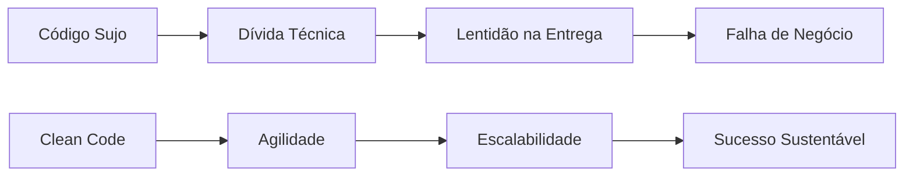

Escrever código que o computador entende é fácil. Escrever código que **outro humano** entende é o verdadeiro desafio da engenharia de software contemporânea.

### O que é Clean Code?

Não é apenas uma questão estética. É sobre **redutibilidade cognitiva**. Se um desenvolvedor precisa de 10 segundos para entender uma função, ela é "limpa". Se precisa de 2 minutos, ela é uma dívida técnica.

#### Princípios SOLID resumidos:

*   **S (Single Responsibility)**: Uma classe deve ter uma única razão para mudar.
*   **O (Open/Closed)**: Aberto para extensão, fechado para modificação.
*   **L (Liskov Substitution)**: Uma subclasse deve poder substituir sua superclasse sem quebrar o comportamento esperado.
*   **I (Interface Segregation)**: Muitas interfaces específicas são melhores que uma geral.
*   **D (Dependency Inversion)**: Dependa de abstrações, não de implementações.

### A Matemática da Manutenibilidade (\(M\))

Podemos pensar na manutenibilidade (\(M\)) como inversamente proporcional ao acoplamento (\(C\)) e à complexidade ciclomática (\(V\)):

$$M \propto \frac{1}{C \cdot V}$$

Ao aplicar SOLID, reduzimos \(C\), aumentando drasticamente a vida útil do software.

> **Heurística Operacional**: Se você precisar de um comentário para explicar **o que** o código faz, o código está errado. O comentário deve explicar apenas o **porquê**.
