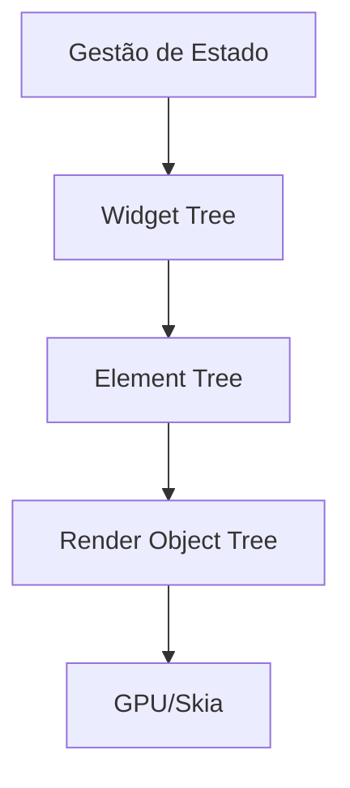

Flutter não é apenas um "wrapper" de UI; é um motor de renderização completo escrito em C++ que utiliza Dart como sua linguagem de orquestração de alto nível.

### O Motor: Skia e Impeller

Enquanto outras tecnologias dependem de pontes (\(bridges\)) para o SO, o Flutter desenha cada pixel na tela (\(painting\)). Isso garante 60 ou 120 FPS constantes, desde que a árvore de widgets seja eficiente.

### Gestão de Estado: O Coração da App

A escolha do gestor de estado (Provider, Riverpod, Bloc, GetX) define como os dados fluem e como a UI reage (\(reactive UI\)).

#### A Árvore de Reconciliação (\(W\))

Podemos pensar na eficiência (\(E\)) do Flutter como função da imutabilidade (\(I\)) e da profundidade da árvore (\(D\)):

$$E \propto \frac{I}{D}$$

### Boas Práticas:

*   **const Widgets**: Use widgets constantes para evitar reconstruções desnecessárias.
*   **Repaint Boundary**: Isole partes da UI que mudam frequentemente para não forçar o redesenho de toda a tela.
*   **Isolates**: Use Threads (Isolates) em Dart para processamento pesado fora da UI Thread.

> **Heurística Operacional**: Se o seu `build` method tem mais de 50 linhas, você não está compondo widgets, está escrevendo um monólito de UI. Decomponha-o.
