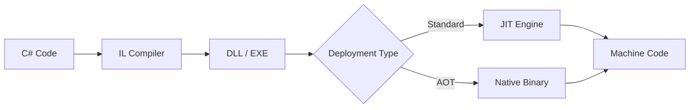

O .NET moderno não é mais o framework lento de 15 anos atrás. Com o .NET 8 e 9, a Microsoft entregou uma plataforma que rivaliza com C++ e Rust em muitos cenários de latência.

### O Garbage Collector (GC)

O GC é geracional (0, 1, 2) e funciona de maneira otimizada para requisições de curta duração (web apps). O maior inimigo da performance é o **LOH (Large Object Heap)**.

### JIT vs Native AOT:

*   **JIT (Just-In-Time)**: Compila o IL para código de máquina na hora da execução. Excelente para otimizações de longo prazo via PGO (Profile-Guided Optimization).
*   **Native AOT (Ahead-Of-Time)**: Compila tudo antes da execução. Gera executáveis menores, com "cold start" quase instantâneo e menor consumo de memória por instância.

#### A Taxa de Alocação (\(A\))

A eficiência (\(E\)) do sistema é inversamente proporcional à pressão sobre o GC (\(P\)), que por sua vez é função da taxa de alocação (\(A\)):

$$E \propto \frac{1}{P(A)}$$

### Técnicas de Performance:

*   **Span e ReadOnlySpan**: Trabalhe com janelas de memória sem alocar cópias.
*   **ArrayPool**: Reutilize buffers para evitar fragmentação da LOH.
*   **ValueTask**: Reduza alocações no heap para operações assíncronas frequentes.

> **Heurística Operacional**: Se o seu serviço leva mais de 500ms para subir no Kubernetes, você deveria considerar Native AOT ou revisar as injeções de dependência pesadas no `Startup`.
