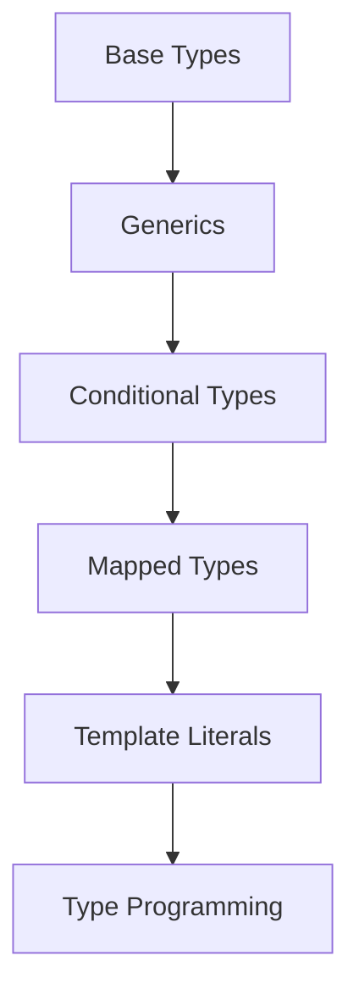

O TypeScript não é apenas "JS com tipos". O sistema de tipos do TS é **Turing-complete**, o que significa que podemos realizar computações complexas apenas em tempo de compilação.

### Tipos Condicionais e `infer`

Tipos condicionais permitem que você defina lógica de seleção de tipos:

```typescript
type IsString<T> = T extends string ? true : false;
type Result = IsString<"hello">; // true
```

O uso de `infer` permite extrair partes de tipos complexos, como o tipo de retorno de uma função ou o tipo de uma Promise.

### Mapeamento de Tipos (\(Mapped Types\))

Transforme um tipo existente em um novo tipo iterando sobre suas propriedades. Útil para criar utilitários como `ReadOnly`, `Partial` ou prefixar chaves de um objeto.

#### A Complexidade do Tipo (\(C\))

Podemos medir a complexidade de um tipo (\(C\)) como o número de transformações e inferências necessárias para o compilador resolvê-lo:

$$C = \sum_{i=1}^n T_i + I_i$$

Se \(C\) for muito alto, o IntelliSense ficará lento e o tempo de compilação aumentará.

### Utilitários de Tipo Customizados:

*   **Template Literal Types**: Combine strings e crie tipos ultra-específicos para rotas ou eventos.
*   **Discriminated Unions**: O padrão ouro para lidar com estados de UI de forma segura.



> **Heurística Operacional**: Se você estiver usando `any` para resolver um problema de tipagem complexo, você não está resolvendo o problema; você está escondendo o bug. Use `unknown` e *type guards* se a tipagem for realmente dinâmica.
