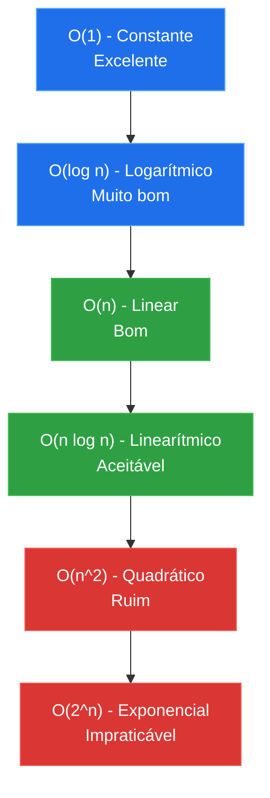
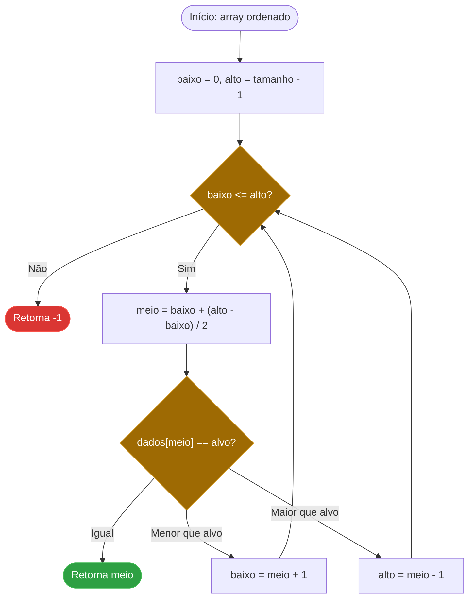

Escrever código que funciona é o primeiro passo. Escrever código que escala é o segundo. A notação **Big O** é a linguagem que usamos para descrever quão rápido um algoritmo cresce à medida que os dados aumentam.

### O Que é Notação Big O?

O Big O foca no **pior cenário**. Ele ignora constantes e foca na curva de crescimento.

*   **O(1)** - Constante: O tempo não muda (ex: acessar um item em um array pelo índice).
*   **O(log n)** - Logarítmico: A eficiência máxima (ex: Busca Binária).
*   **O(n)** - Linear: O tempo cresce proporcionalmente aos dados (ex: percorrer uma lista).
*   **O(n log n)** - Linearitmo: O padrão para ordenação eficiente (ex: Merge Sort, Quick Sort).
*   **O(n^2)** - Quadrático: O perigo dos loops aninhados.



#### Busca Linear: o Caminho Ingênuo (O(n))

A **Busca Linear** percorre a coleção item a item até encontrar o alvo ou esgotar o array. É a implementação mais simples possível e não exige dados ordenados, mas seu custo cresce junto com o volume de dados: no pior caso, percorre todos os `n` elementos.

```csharp
// Busca Linear - O(n)
public static int BuscaLinear(int[] dados, int alvo)
{
    for (int i = 0; i < dados.Length; i++)
    {
        if (dados[i] == alvo)
            return i;
    }
    return -1;
}
```

O mesmo algoritmo em C, sem o runtime gerenciado do .NET por trás: o tamanho do array não viaja com o ponteiro, então precisa ser passado à parte.

```c
/* Busca Linear - O(n) */
int busca_linear(const int *dados, int tamanho, int alvo)
{
    for (int i = 0; i < tamanho; i++)
    {
        if (dados[i] == alvo)
            return i;
    }
    return -1;
}
```

#### Busca Binária: a Mágica do Logaritmo

Imagine procurar um nome em uma lista telefônica de 1 milhão de páginas. Uma busca linear (página por página) levaria até 1 milhão de passos. Uma **Busca Binária** (dividindo ao meio) levaria apenas **20 passos**.

O requisito é que os dados estejam **ordenados**. A cada comparação, metade do espaço de busca é descartada, o que produz o crescimento logarítmico.

```csharp
// Busca Binária - O(log n) - requer array ordenado
public static int BuscaBinaria(int[] dados, int alvo)
{
    int baixo = 0;
    int alto = dados.Length - 1;

    while (baixo <= alto)
    {
        int meio = baixo + (alto - baixo) / 2;

        if (dados[meio] == alvo)
            return meio;

        if (dados[meio] < alvo)
            baixo = meio + 1;
        else
            alto = meio - 1;
    }

    return -1;
}
```

Em C, a mesma lógica — a única armadilha clássica é `(baixo + alto) / 2` poder estourar o `int` em arrays gigantes; por isso `baixo + (alto - baixo) / 2`.

```c
/* Busca Binaria - O(log n) - requer array ordenado */
int busca_binaria(const int *dados, int tamanho, int alvo)
{
    int baixo = 0;
    int alto = tamanho - 1;

    while (baixo <= alto)
    {
        int meio = baixo + (alto - baixo) / 2;

        if (dados[meio] == alvo)
            return meio;

        if (dados[meio] < alvo)
            baixo = meio + 1;
        else
            alto = meio - 1;
    }

    return -1;
}
```



#### Ordenação: O(n²) contra O(n log n) na Prática

A diferença de complexidade fica ainda mais visível em algoritmos de ordenação. O **Bubble Sort** compara pares adjacentes em dois loops aninhados, o que o torna O(n²): didático, mas inviável para bases grandes.

```csharp
// Bubble Sort - O(n^2) - didático, evite em produção
public static void BubbleSort(int[] dados)
{
    for (int i = 0; i < dados.Length - 1; i++)
    {
        for (int j = 0; j < dados.Length - i - 1; j++)
        {
            if (dados[j] > dados[j + 1])
                (dados[j], dados[j + 1]) = (dados[j + 1], dados[j]);
        }
    }
}
```

Em C não existe tupla para trocar dois valores de uma vez; a troca precisa de uma variável temporária explícita.

```c
/* Bubble Sort - O(n^2) - didatico, evite em producao */
void bubble_sort(int *dados, int tamanho)
{
    for (int i = 0; i < tamanho - 1; i++)
    {
        for (int j = 0; j < tamanho - i - 1; j++)
        {
            if (dados[j] > dados[j + 1])
            {
                int temp = dados[j];
                dados[j] = dados[j + 1];
                dados[j + 1] = temp;
            }
        }
    }
}
```

Já o **Merge Sort** divide o array recursivamente pela metade e combina os resultados ordenados, alcançando O(n log n). É a mesma ideia por trás do `Array.Sort` no .NET, um Introsort que combina Quicksort, Heapsort e Insertion Sort conforme o tamanho da entrada.

```csharp
// Merge Sort - O(n log n) - dividir para conquistar
public static int[] MergeSort(int[] dados)
{
    if (dados.Length <= 1)
        return dados;

    int meio = dados.Length / 2;
    int[] esquerda = MergeSort(dados[..meio]);
    int[] direita = MergeSort(dados[meio..]);

    return Merge(esquerda, direita);
}

private static int[] Merge(int[] esquerda, int[] direita)
{
    var resultado = new int[esquerda.Length + direita.Length];
    int i = 0, j = 0, k = 0;

    while (i < esquerda.Length && j < direita.Length)
        resultado[k++] = esquerda[i] <= direita[j] ? esquerda[i++] : direita[j++];

    while (i < esquerda.Length) resultado[k++] = esquerda[i++];
    while (j < direita.Length) resultado[k++] = direita[j++];

    return resultado;
}
```

Em C não existe garbage collector: cada `malloc` precisa do `free` correspondente, e o buffer auxiliar do merge é responsabilidade de quem chamou a função.

```c
#include <stdlib.h>
#include <string.h>

/* Merge Sort - O(n log n) - dividir para conquistar.
   Ordena in-place; "buffer" precisa ter pelo menos "tamanho" posicoes. */
void merge_sort(int *dados, int tamanho, int *buffer)
{
    if (tamanho <= 1)
        return;

    int meio = tamanho / 2;
    merge_sort(dados, meio, buffer);
    merge_sort(dados + meio, tamanho - meio, buffer);

    int i = 0, j = meio, k = 0;
    while (i < meio && j < tamanho)
        buffer[k++] = (dados[i] <= dados[j]) ? dados[i++] : dados[j++];
    while (i < meio) buffer[k++] = dados[i++];
    while (j < tamanho) buffer[k++] = dados[j++];

    memcpy(dados, buffer, tamanho * sizeof(int));
}

/* Uso: aloca o buffer auxiliar uma unica vez, fora da recursao. */
void ordenar(int *dados, int tamanho)
{
    int *buffer = malloc(tamanho * sizeof(int));
    merge_sort(dados, tamanho, buffer);
    free(buffer);
}
```

#### Por que se Importar?

Em sistemas com poucos dados, qualquer algoritmo serve. Mas em sistemas de produção com milhões de registros, a diferença entre O(n log n) e O(n²) é a diferença entre uma resposta instantânea e um servidor travado. Uma busca linear em uma coleção que deveria ser um `Dictionary<TKey, TValue>` (O(1) de acesso), ou um `Sort()` chamado dentro de um loop, são erros de complexidade que só aparecem em produção, sob carga.

### Conclusão

Entender complexidade de algoritmos transforma você de um "escritor de código" em um "engenheiro de software". Antes de cada loop, pergunte-se: "Qual é o Big O disso?" E antes de escolher uma estrutura de dados, pergunte-se: "essa operação roda em O(1), O(log n) ou O(n)?"
