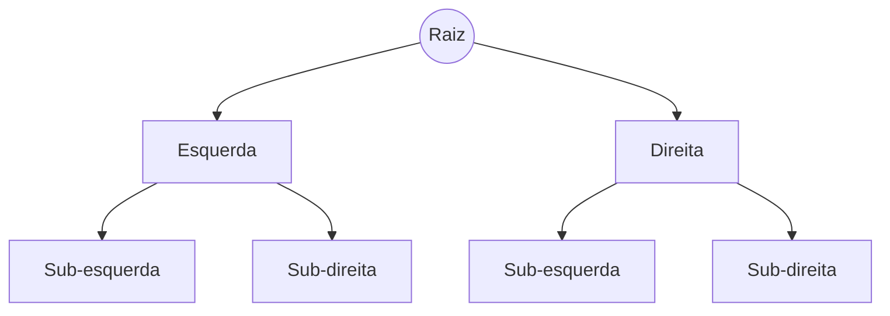

Sistemas de software são, em última análise, o gerenciamento de dados em movimento e em repouso. Aprender **Estrutura de Dados** é entender como organizar esses dados para que o computador trabalhe menos e entregue mais.

### Pilhas (Stacks): LIFO (Last-In, First-Out)

O último que entra é o primeiro que sai. O exemplo clássico é o botão "Desfazer" (Undo) do seu editor de código ou a própria pilha de chamadas (Call Stack) do runtime.

Em C, a forma mais direta é um array de tamanho fixo com um índice `topo` — sem alocação dinâmica, sem coleta de lixo, só um contador que sobe no `push` e desce no `pop`:

```c
#define CAPACIDADE 128

typedef struct {
    int dados[CAPACIDADE];
    int topo; /* -1 = pilha vazia */
} Pilha;

void pilha_init(Pilha *p) { p->topo = -1; }

int pilha_vazia(const Pilha *p) { return p->topo == -1; }

int pilha_cheia(const Pilha *p) { return p->topo == CAPACIDADE - 1; }

void pilha_push(Pilha *p, int valor)
{
    if (pilha_cheia(p)) return; /* producao real: sinalizar overflow */
    p->dados[++p->topo] = valor;
}

int pilha_pop(Pilha *p)
{
    if (pilha_vazia(p)) return -1; /* producao real: sinalizar underflow */
    return p->dados[p->topo--];
}
```

### Filas (Queues): FIFO (First-In, First-Out)

O primeiro que entra é o primeiro que sai. Essencial para processamento de tarefas em background e sistemas de mensageria que garantem a ordem.

Uma fila circular reaproveita o mesmo array em vez de deslocar elementos a cada `dequeue` — `inicio` e `fim` andam em círculo com o operador `%`:

```c
#define CAPACIDADE 128

typedef struct {
    int dados[CAPACIDADE];
    int inicio;
    int fim;
    int tamanho;
} Fila;

void fila_init(Fila *f) { f->inicio = 0; f->fim = 0; f->tamanho = 0; }

int fila_vazia(const Fila *f) { return f->tamanho == 0; }

int fila_cheia(const Fila *f) { return f->tamanho == CAPACIDADE; }

void fila_enqueue(Fila *f, int valor)
{
    if (fila_cheia(f)) return; /* producao real: sinalizar overflow */
    f->dados[f->fim] = valor;
    f->fim = (f->fim + 1) % CAPACIDADE;
    f->tamanho++;
}

int fila_dequeue(Fila *f)
{
    if (fila_vazia(f)) return -1; /* producao real: sinalizar underflow */
    int valor = f->dados[f->inicio];
    f->inicio = (f->inicio + 1) % CAPACIDADE;
    f->tamanho--;
    return valor;
}
```

### Árvores e sua Eficiência Hierárquica

Árvores (especialmente as Binárias de Busca) permitem localizar, inserir e remover dados de forma extremamente rápida. Elas são a base de:

*   **Sistemas de Arquivos**: Onde pastas contêm subpastas.
*   **DOM (Document Object Model)**: A estrutura de toda página web.
*   **Índices de Banco de Dados**: O segredo para queries que não travam.



Uma Árvore Binária de Busca mantém a invariante "esquerda menor, direita maior" em cada nó — é essa invariante que permite descartar metade da árvore a cada comparação. Isso só rende O(log n) quando a árvore está balanceada: inserida em ordem crescente, ela degenera numa lista ligada e a busca cai para O(n) (daí variantes auto-balanceadas como AVL e Red-Black):

```c
#include <stdlib.h>

typedef struct No {
    int valor;
    struct No *esquerda;
    struct No *direita;
} No;

No *no_criar(int valor)
{
    No *novo = malloc(sizeof(No));
    novo->valor = valor;
    novo->esquerda = NULL;
    novo->direita = NULL;
    return novo;
}

No *arvore_inserir(No *raiz, int valor)
{
    if (raiz == NULL)
        return no_criar(valor);

    if (valor < raiz->valor)
        raiz->esquerda = arvore_inserir(raiz->esquerda, valor);
    else if (valor > raiz->valor)
        raiz->direita = arvore_inserir(raiz->direita, valor);
    /* valor == raiz->valor: ja existe, nao duplica */

    return raiz;
}

No *arvore_buscar(No *raiz, int valor)
{
    if (raiz == NULL || raiz->valor == valor)
        return raiz;

    if (valor < raiz->valor)
        return arvore_buscar(raiz->esquerda, valor);
    return arvore_buscar(raiz->direita, valor);
}
```

#### Qual Escolher?

| Problema | Estrutura Ideal |
| --- | --- |
| Histórico de Navegação | Pilha |
| Gerenciamento de Impressão | Fila |
| Busca em Grande Volume | Árvores (B-Tree, AVL) |
| Relacionamentos Rápidos | Hash Table |

### Conclusão

Ter um martelo não faz de você um mestre de obras. Saber qual estrutura usar para cada problema é o que separa um programador iniciante de um engenheiro de software profissional.
