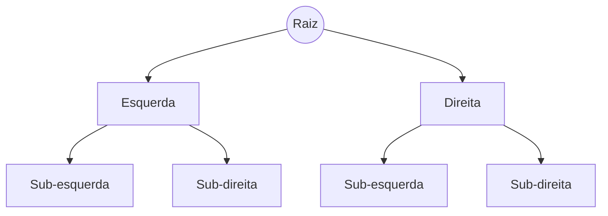

Sistemas de software são, em última análise, o gerenciamento de dados em movimento e em repouso. Aprender **Estrutura de Dados** é entender como organizar esses dados para que o computador trabalhe menos e entregue mais.

### Pilhas (Stacks): LIFO (Last-In, First-Out)

O último que entra é o primeiro que sai. O exemplo clássico é o botão "Desfazer" (Undo) do seu editor de código ou a própria pilha de chamadas (Call Stack) do runtime.

### Filas (Queues): FIFO (First-In, First-Out)

O primeiro que entra é o primeiro que sai. Essencial para processamento de tarefas em background e sistemas de mensageria que garantem a ordem.

### Árvores e sua Eficiência Hierárquica

Árvores (especialmente as Binárias de Busca) permitem localizar, inserir e remover dados de forma extremamente rápida. Elas são a base de:

*   **Sistemas de Arquivos**: Onde pastas contêm subpastas.
*   **DOM (Document Object Model)**: A estrutura de toda página web.
*   **Índices de Banco de Dados**: O segredo para queries que não travam.

#### Qual Escolher?

Problema

Estrutura Ideal

Histórico de Navegação

Pilha

Gerenciamento de Impressão

Fila

Busca em Grande Volume

Árvores (B-Tree, AVL)

Relacionamentos Rápidos

Hash Table

### Conclusão

Ter um martelo não faz de você um mestre de obras. Saber qual estrutura usar para cada problema é o que separa um programador iniciante de um engenheiro de software profissional.
