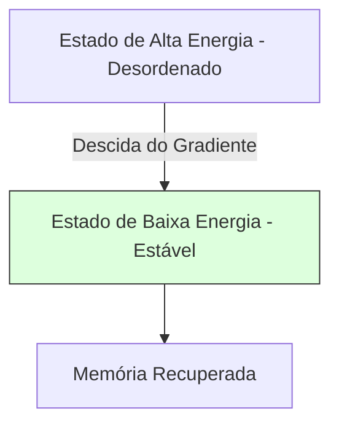

A inteligência artificial não nasceu apenas de algoritmos matemáticos puros, ela bebeu da fonte da **Física Estatística**. Muitos dos modelos que usamos hoje tratam a informação como se fosse energia em um sistema físico.

### Entropia e a Busca pela Ordem

Na física, a entropia mede a desordem. Na IA, usamos a **Entropia Cruzada** (Cross-Entropy) para medir quão longe nossa rede está da resposta correta. Treinar uma rede é, essencialmente, reduzir a desordem da sua predição.

### Redes de Hopfield e a Energia de um Sistema

John Hopfield, físico de formação, criou uma rede neural onde a memória é um estado de **Mínima Energia**. Imagine uma bola rolando em uma paisagem de montanhas; a memória é o fundo do vale.

#### Diffusion Models: Criando do Caos

Os modelos de imagem modernos (como Midjourney ou Stable Diffusion) usam um processo físico inverso. Eles adicionam ruído (caos/entropia) a uma imagem até que ela vire chiado puro e, então, ensinam a rede a **reverter a difusão**, extraindo ordem do caos.

### A Matemática do Aprendizado

Muitos algoritmos de otimização usam o conceito de **Simulated Annealing** (Recozimento Simulado), inspirado na forma como os metais são resfriados lentamente para atingir uma estrutura cristalina perfeita (o mínimo global).

### Conclusão

A IA está se aproximando cada vez mais de uma "Física da Informação". Entender as leis da termodinâmica e da energia nos dá uma intuição poderosa sobre por que as redes neurais funcionam e como podemos torná-las mais eficientes.
