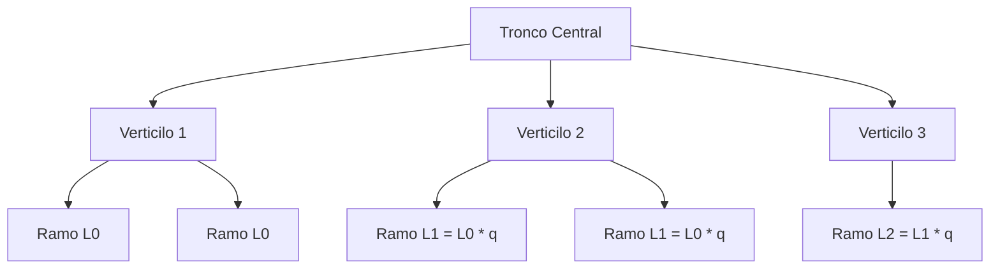

A *Araucaria angustifolia*, o "Pinheiro-do-Paraná", não é apenas um ícone biológico, mas um exemplo fascinante de organização geométrica e eficiência estrutural. Para replicar sua forma em um ambiente digital 3D, utilizamos modelos matemáticos que capturam sua essência fractal e simétrica.

### 1. Estrutura Vertical: Os Verticilos

Diferente de muitas árvores que possuem ramificações aleatórias, a araucária cresce em **andares** ou **verticilos**. Cada andar é uma repetição horizontal de ramos saindo de um ponto comum no tronco.

A altura de cada verticilo $n$ pode ser descrita por:

$$h_n = h_0 + n \cdot \Delta h$$

*   $h_n$ é a altura do andar.
*   $\Delta h$ é o espaçamento entre verticilos.

### 2. Simetria Angular

Dentro de cada andar, os galhos buscam maximizar a captura de luz através da simetria radial:

$$\theta_{n,m} = \frac{2\pi m}{b_n}$$

### 3. Redução de Comprimento (Decaimento Exponencial)

À medida que a árvore ganha altura, os galhos tornam-se progressivamente menores, definindo a silhueta em forma de taça. Este comportamento segue uma função de decaimento:

$$L_n = L_0 \cdot q^n$$

### 4. Modelagem Fractal e L-Systems

A complexidade da araucária pode ser resumida por regras de substituição simples em um **L-System**:

`A → F [ α1 A ] [ α2 A ] [ α3 A ] ...`

Cada ramo "A" cresce um segmento "F" e gera novos sub-ramos em ângulos específicos. Essa auto-semelhança é o que permite que a visualização mude de escala mantendo a identidade visual característica.

#### Representação Visual

A combinação desses fatores — periodicidade vertical, simetria angular e decaimento de escala — cria a base para o nosso **Projeto Araucária**, transformando dados técnicos em uma floresta digital de conhecimento.
