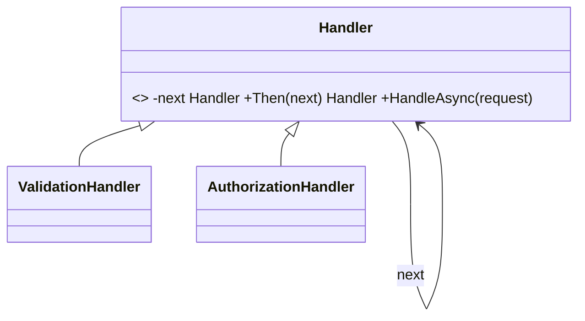
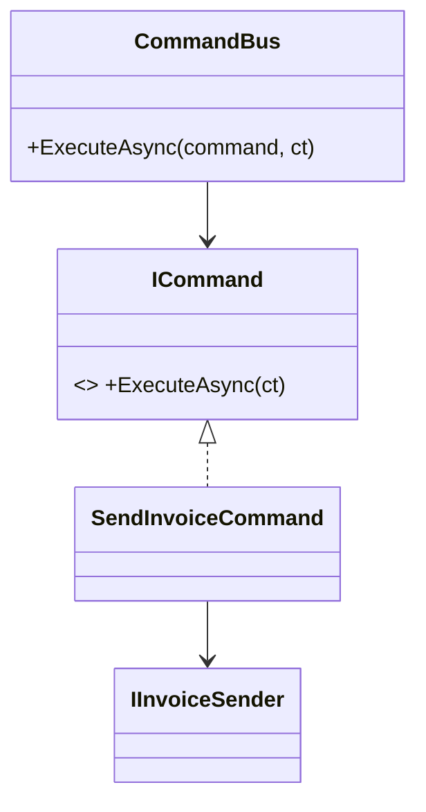
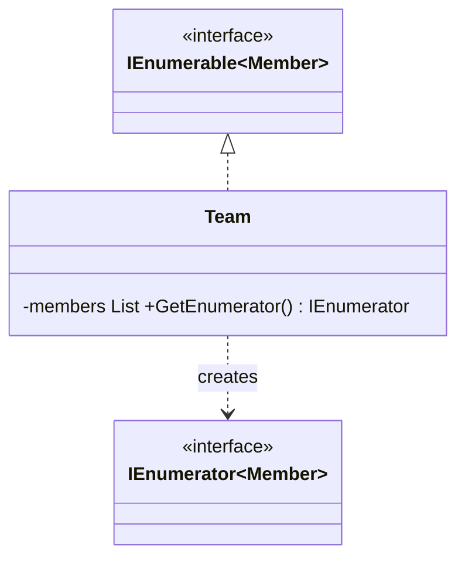
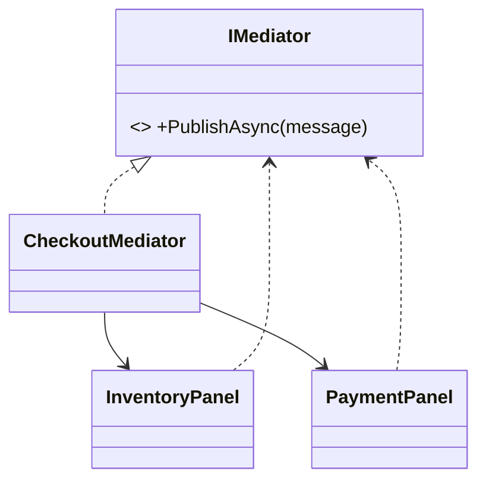
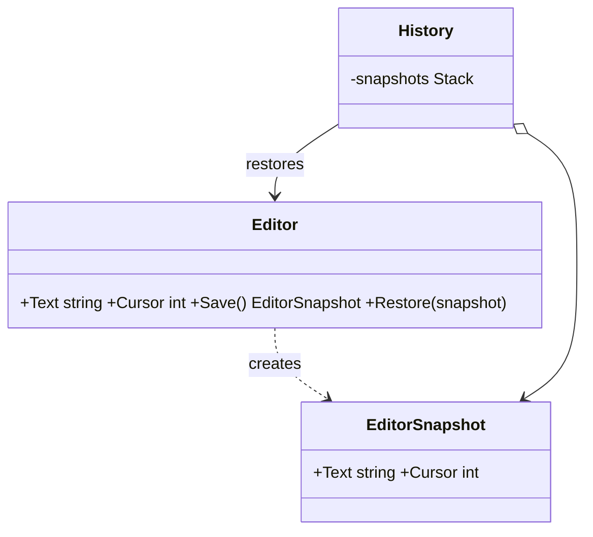
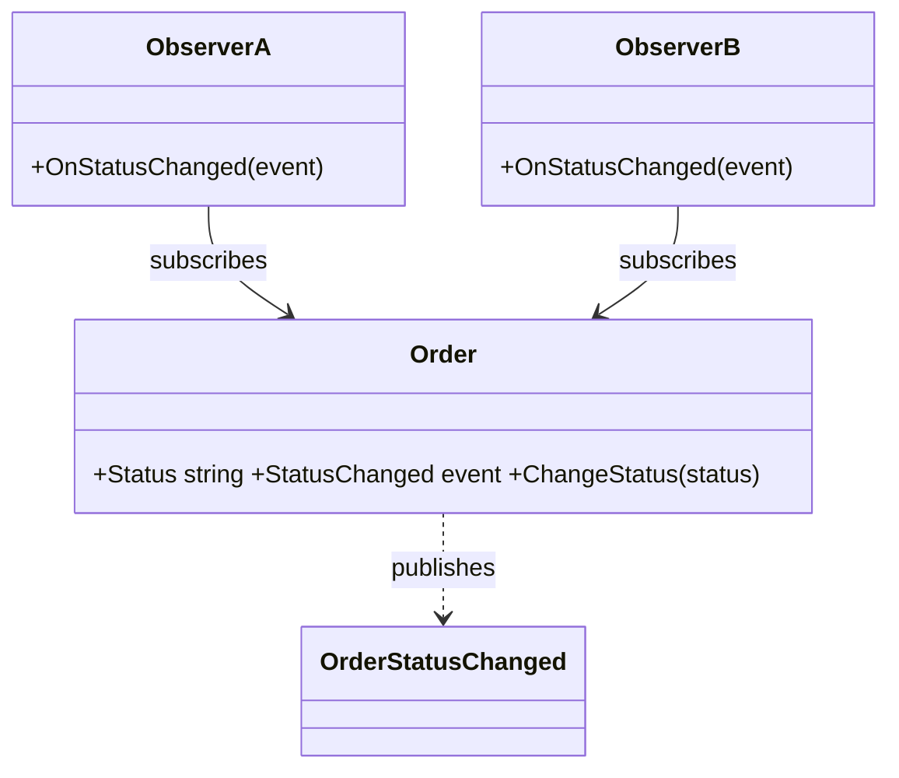
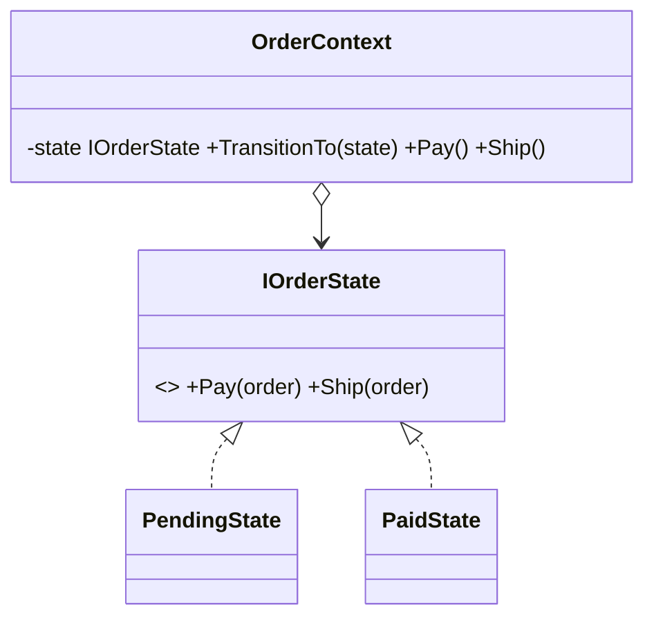
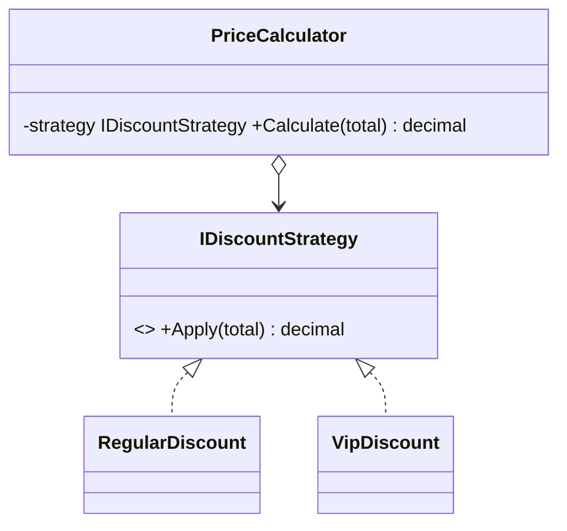
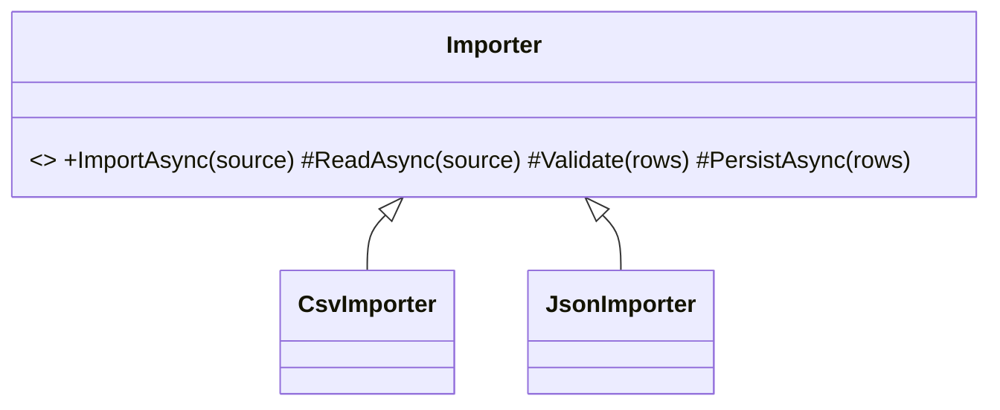
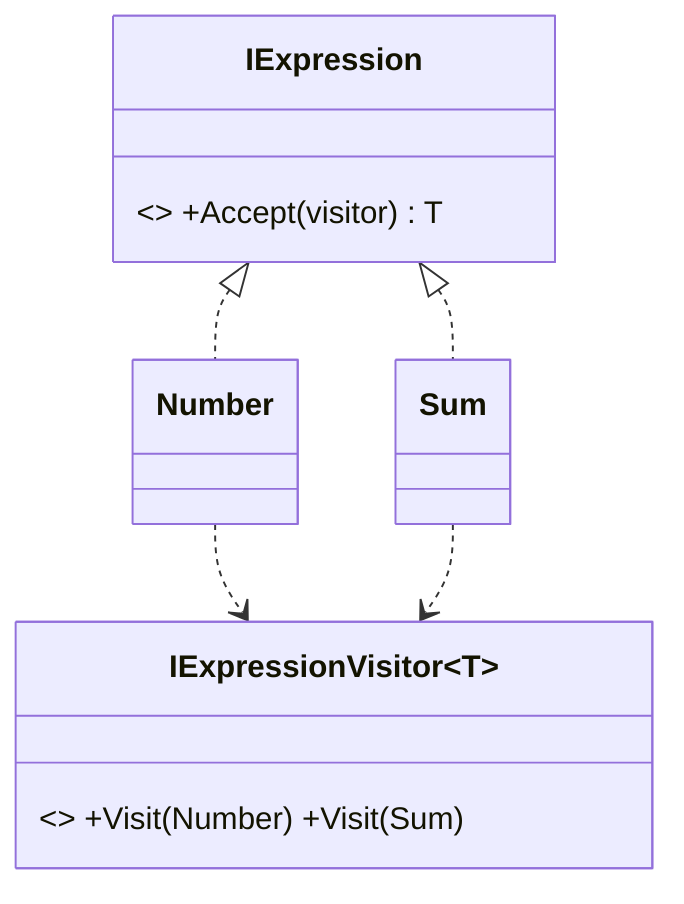

Dez padrões para distribuir responsabilidades, comunicação e algoritmos.

## Chain of Responsibility

Intenção. Passa uma solicitação por uma cadeia de handlers até que seja tratada ou a cadeia termine.

### Quando usar

Para pipelines de validação, middleware, autorização e processamento com etapas independentes.

### Por que usar e benefícios

Desacopla remetente e receptor; permite reordenar etapas; favorece handlers pequenos.

### Custos e cuidados

A ordem pode alterar o resultado e uma requisição pode terminar sem tratamento.

### Estrutura



### Exemplo em C#

```csharp
public abstract class Handler {
    private Handler? _next;
    public Handler Then(Handler next) { _next = next; return next; }
    public virtual Task HandleAsync(Request request) => _next?.HandleAsync(request) ?? Task.CompletedTask;
}
public sealed class ValidationHandler : Handler {
    public override Task HandleAsync(Request request) {
        if (!request.IsValid) throw new ValidationException();
        return base.HandleAsync(request);
    }
}
```

## Command

Intenção. Encapsula uma solicitação como objeto, incluindo dados necessários para executá-la.

### Quando usar

Para filas, undo, auditoria, agendamento, retries ou separação entre UI/API e execução.

### Por que usar e benefícios

Torna operações transportáveis e registráveis; facilita composição e histórico.

### Custos e cuidados

Cria tipos adicionais e exige cuidado com idempotência em processamento assíncrono.

### Estrutura



### Exemplo em C#

```csharp
public interface ICommand { Task ExecuteAsync(CancellationToken ct); }
public sealed record SendInvoiceCommand(Guid InvoiceId, IInvoiceSender Sender) : ICommand {
    public Task ExecuteAsync(CancellationToken ct) => Sender.SendAsync(InvoiceId, ct);
}
public sealed class CommandBus {
    public Task ExecuteAsync(ICommand command, CancellationToken ct) => command.ExecuteAsync(ct);
}
```

## Iterator

Intenção. Percorre uma coleção sem expor sua representação interna.

### Quando usar

Quando uma estrutura exige diferentes travessias ou deve preservar encapsulamento.

### Por que usar e benefícios

Uniformiza iteração; suporta lazy evaluation; combina naturalmente com IEnumerable<T>.

### Custos e cuidados

Em C#, frequentemente já é fornecido pela plataforma; criar um iterator manual pode ser redundante.

### Estrutura



### Exemplo em C#

```csharp
public sealed class Team : IEnumerable<Member> {
    private readonly List<Member> _members = [];
    public void Add(Member member) => _members.Add(member);
    public IEnumerator<Member> GetEnumerator() {
        foreach (var member in _members.Where(x => x.IsActive)) yield return member;
    }
    System.Collections.IEnumerator System.Collections.IEnumerable.GetEnumerator() => GetEnumerator();
}
```

## Mediator

Intenção. Centraliza a comunicação entre objetos que não devem referenciar uns aos outros diretamente.

### Quando usar

Quando muitos componentes formam dependências cruzadas, como UI, workflow ou coordenação de casos de uso.

### Por que usar e benefícios

Reduz acoplamento entre colegas; torna interações explícitas em um ponto.

### Custos e cuidados

O mediador pode se tornar complexo e concentrar lógica de negócio demais.

### Estrutura



### Exemplo em C#

```csharp
public interface IMediator { Task PublishAsync<T>(T message); }
public sealed class CheckoutMediator(InventoryPanel inventory, PaymentPanel payment) : IMediator {
    public Task PublishAsync<T>(T message) => message switch {
        ItemSelected e => inventory.ReserveAsync(e.ItemId),
        PaymentConfirmed e => payment.ShowReceiptAsync(e.PaymentId),
        _ => Task.CompletedTask
    };
}
```

## Memento

Intenção. Captura e restaura o estado de um objeto sem expor seus detalhes internos.

### Quando usar

Para undo, checkpoints, snapshots de edição e recuperação de workflows.

### Por que usar e benefícios

Preserva encapsulamento; simplifica restauração; permite histórico.

### Custos e cuidados

Snapshots grandes consomem memória e podem ficar incompatíveis após mudanças de versão.

### Estrutura



### Exemplo em C#

```csharp
public sealed record EditorSnapshot(string Text, int Cursor);
public sealed class Editor {
    public string Text { get; private set; } = "";
    public int Cursor { get; private set; }
    public EditorSnapshot Save() => new(Text, Cursor);
    public void Restore(EditorSnapshot snapshot) => (Text, Cursor) = (snapshot.Text, snapshot.Cursor);
    public void Write(string text) { Text += text; Cursor = Text.Length; }
}
```

## Observer

Intenção. Notifica múltiplos assinantes quando o estado de um sujeito muda.

### Quando usar

Para eventos de domínio, atualização de UI, integrações internas e reações desacopladas.

### Por que usar e benefícios

Um publicador não conhece detalhes dos assinantes; permite extensão por inscrição.

### Custos e cuidados

Assinaturas esquecidas causam vazamentos; ordem, falhas e consistência precisam ser definidas.

### Estrutura



### Exemplo em C#

```csharp
public sealed class Order {
    public event EventHandler<OrderStatusChanged>? StatusChanged;
    public string Status { get; private set; } = "New";
    public void ChangeStatus(string status) {
        Status = status;
        StatusChanged?.Invoke(this, new(status));
    }
}
public sealed record OrderStatusChanged(string Status);
```

## State

Intenção. Move comportamentos dependentes de estado para objetos de estado intercambiáveis.

### Quando usar

Quando condicionais extensos variam conforme o ciclo de vida de uma entidade.

### Por que usar e benefícios

Torna transições explícitas; elimina switches crescentes; localiza regras por estado.

### Custos e cuidados

Pode multiplicar classes e esconder transições se o contexto não as controlar claramente.

### Estrutura



### Exemplo em C#

```csharp
public interface IOrderState { void Pay(OrderContext order); void Ship(OrderContext order); }
public sealed class PendingState : IOrderState {
    public void Pay(OrderContext order) => order.TransitionTo(new PaidState());
    public void Ship(OrderContext order) => throw new InvalidOperationException();
}
public sealed class OrderContext {
    private IOrderState _state = new PendingState();
    public void TransitionTo(IOrderState state) => _state = state;
    public void Pay() => _state.Pay(this);
    public void Ship() => _state.Ship(this);
}
```

## Strategy

Intenção. Encapsula algoritmos intercambiáveis atrás de uma mesma interface.

### Quando usar

Quando uma regra varia por cliente, contexto, configuração ou política e não deve ficar em condicionais.

### Por que usar e benefícios

Permite troca e teste isolado; favorece composição; mantém o contexto simples.

### Custos e cuidados

O cliente precisa escolher uma estratégia e muitas estratégias minúsculas podem fragmentar o código.

### Estrutura



### Exemplo em C#

```csharp
public interface IDiscountStrategy { decimal Apply(decimal total); }
public sealed class RegularDiscount : IDiscountStrategy { public decimal Apply(decimal total) => total; }
public sealed class VipDiscount : IDiscountStrategy { public decimal Apply(decimal total) => total * 0.9m; }
public sealed class PriceCalculator(IDiscountStrategy strategy) {
    public decimal Calculate(decimal total) => strategy.Apply(total);
}
```

## Template Method

Intenção. Define o esqueleto de um algoritmo em uma classe base e permite sobrescrever etapas específicas.

### Quando usar

Quando diferentes processos seguem a mesma sequência, mas variam em alguns passos.

### Por que usar e benefícios

Reutiliza fluxo comum; protege invariantes da sequência; oferece hooks controlados.

### Custos e cuidados

Herança cria acoplamento forte e pode levar a bases frágeis; prefira composição quando etapas variam livremente.

### Estrutura



### Exemplo em C#

```csharp
public abstract class Importer {
    public async Task ImportAsync(Stream source) {
        var rows = await ReadAsync(source);
        Validate(rows);
        await PersistAsync(rows);
    }
    protected abstract Task<IReadOnlyList<Row>> ReadAsync(Stream source);
    protected virtual void Validate(IReadOnlyList<Row> rows) { }
    protected abstract Task PersistAsync(IReadOnlyList<Row> rows);
}
```

## Visitor

Intenção. Adiciona operações a uma estrutura de objetos sem modificar as classes dos elementos.

### Quando usar

Quando a estrutura de tipos é estável, mas novas operações surgem com frequência, como exportação, cálculo e validação.

### Por que usar e benefícios

Centraliza operações por visitante; evita poluir elementos com responsabilidades externas.

### Custos e cuidados

Adicionar um novo tipo de elemento exige modificar todos os visitantes; double dispatch aumenta complexidade.

### Estrutura



### Exemplo em C#

```csharp
public interface IExpression { T Accept<T>(IExpressionVisitor<T> visitor); }
public sealed record Number(decimal Value) : IExpression {
    public T Accept<T>(IExpressionVisitor<T> visitor) => visitor.Visit(this);
}
public sealed record Sum(IExpression Left, IExpression Right) : IExpression {
    public T Accept<T>(IExpressionVisitor<T> visitor) => visitor.Visit(this);
}
public interface IExpressionVisitor<T> { T Visit(Number number); T Visit(Sum sum); }
```
