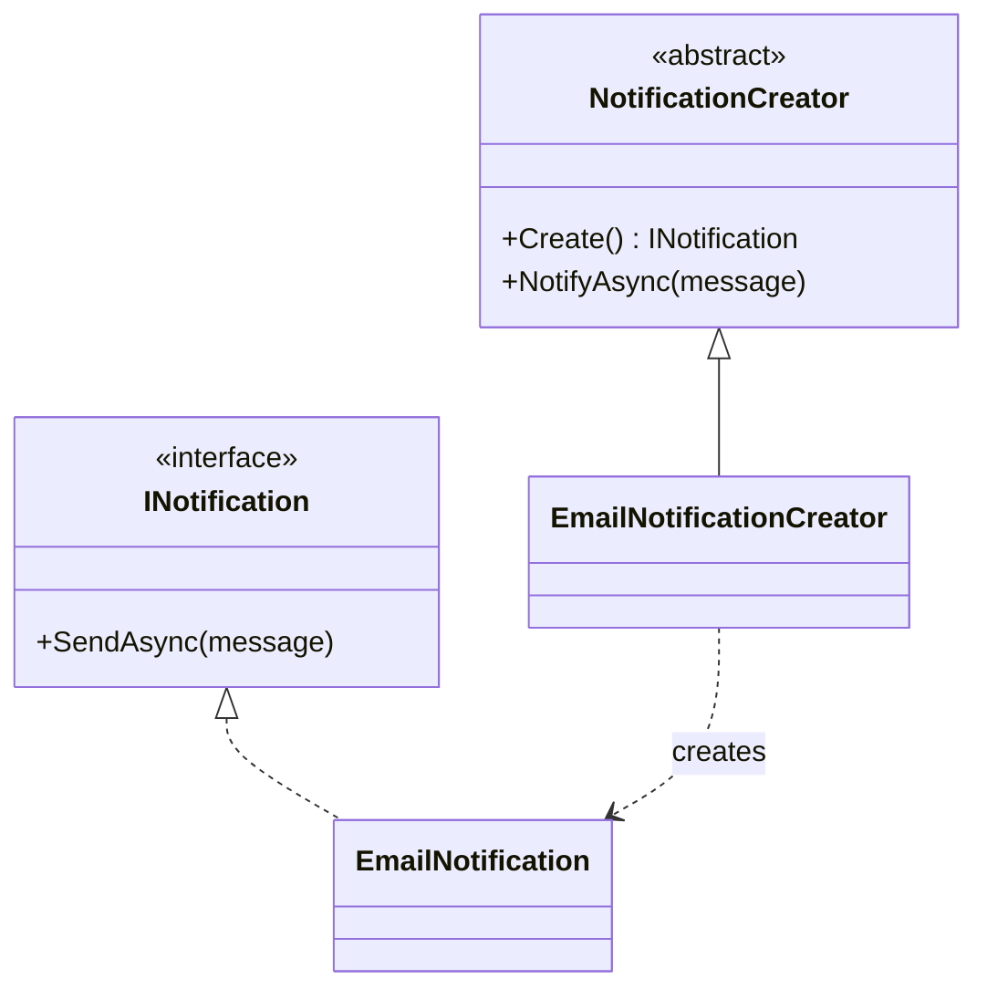
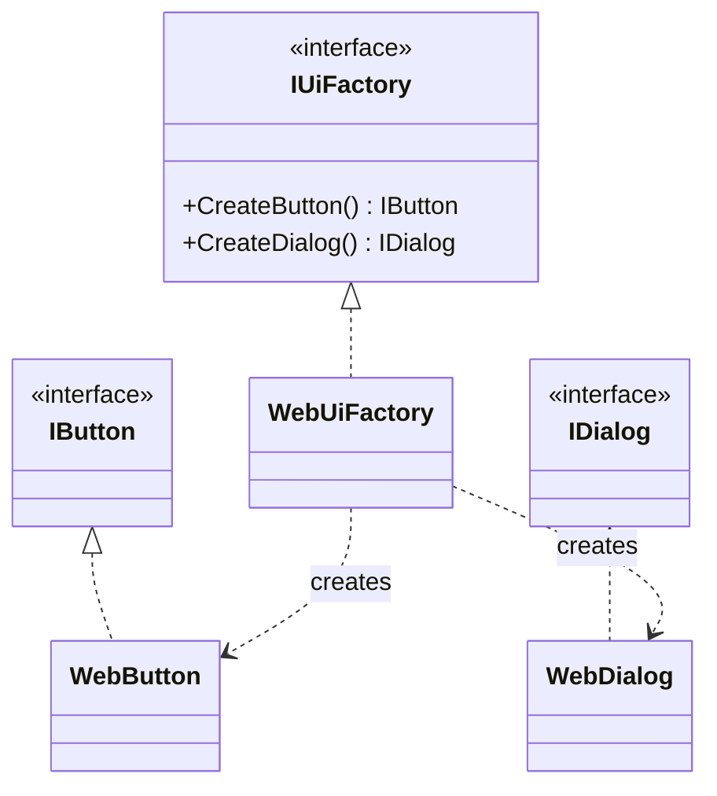
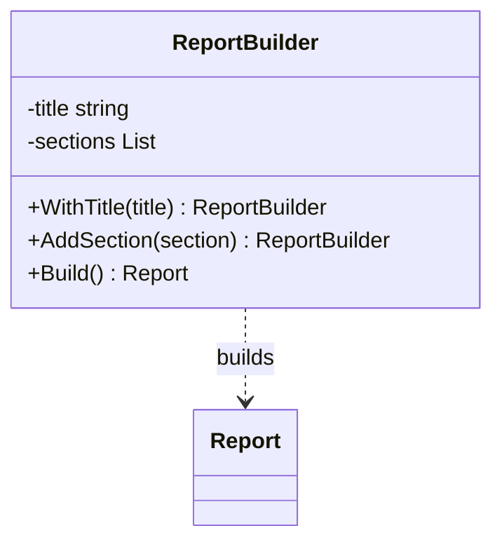
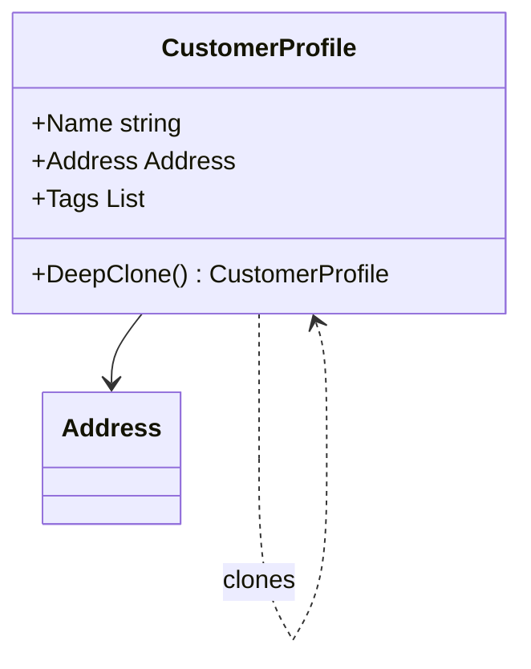
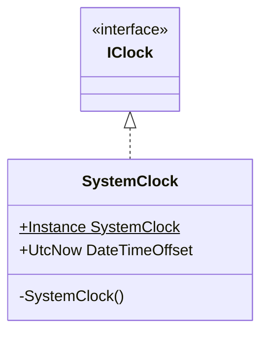

Os exemplos são deliberadamente pequenos para evidenciar a colaboração entre os participantes. Em produção, combine-os com DI, logging, cancelamento, tratamento de falhas e testes.

## Factory Method

Intenção. Delega a criação de objetos para subclasses ou implementações especializadas.

### Quando usar

Quando o código cliente conhece a abstração, mas não deve depender da classe concreta; quando novos tipos de produto surgem com frequência.

### Por que usar e benefícios

Reduz acoplamento entre criação e uso; favorece Open/Closed; centraliza regras de construção.

### Custos e cuidados

Pode introduzir hierarquias e classes extras para uma criação que talvez fosse simples.

### Estrutura



### Exemplo em C#

```csharp
public interface INotification { Task SendAsync(string message); }
public sealed class EmailNotification : INotification {
    public Task SendAsync(string message) => Task.CompletedTask;
}
public abstract class NotificationCreator {
    public abstract INotification Create();
    public Task NotifyAsync(string message) => Create().SendAsync(message);
}
public sealed class EmailNotificationCreator : NotificationCreator {
    public override INotification Create() => new EmailNotification();
}
```

## Abstract Factory

Intenção. Cria famílias de objetos relacionados sem expor suas classes concretas.

### Quando usar

Quando componentes precisam variar em conjunto — por exemplo, UI, provedores de nuvem, persistência ou integrações por região.

### Por que usar e benefícios

Garante compatibilidade entre produtos; isola famílias concretas; facilita troca de infraestrutura.

### Custos e cuidados

Adicionar um novo tipo de produto exige alterar todas as fábricas.

### Estrutura



### Exemplo em C#

```csharp
public interface IButton { string Render(); }
public interface IDialog { string Render(); }
public interface IUiFactory {
    IButton CreateButton();
    IDialog CreateDialog();
}
public sealed class WebUiFactory : IUiFactory {
    public IButton CreateButton() => new WebButton();
    public IDialog CreateDialog() => new WebDialog();
}
public sealed class WebButton : IButton { public string Render() => "<button>OK</button>"; }
public sealed class WebDialog : IDialog { public string Render() => "<dialog>...</dialog>"; }
```

## Builder

Intenção. Constrói objetos complexos em etapas, separando o processo da representação final.

### Quando usar

Quando há muitos parâmetros opcionais, invariantes de construção ou diferentes representações do mesmo processo.

### Por que usar e benefícios

Torna a criação legível; evita construtores telescópicos; permite validar antes de produzir o objeto.

### Custos e cuidados

Builders mutáveis podem ser reutilizados incorretamente; não vale a pena para objetos simples.

### Estrutura



### Exemplo em C#

```csharp
public sealed record Report(string Title, IReadOnlyList<string> Sections);
public sealed class ReportBuilder {
    private string _title = string.Empty;
    private readonly List<string> _sections = [];
    public ReportBuilder WithTitle(string title) { _title = title; return this; }
    public ReportBuilder AddSection(string section) { _sections.Add(section); return this; }
    public Report Build() {
        if (string.IsNullOrWhiteSpace(_title)) throw new InvalidOperationException("Title required.");
        return new Report(_title, _sections.ToArray());
    }
}
var report = new ReportBuilder().WithTitle("Q2").AddSection("Revenue").Build();
```

## Prototype

Intenção. Cria novos objetos copiando uma instância existente, preservando configuração complexa.

### Quando usar

Quando construir do zero é caro ou quando modelos preconfigurados devem originar variações independentes.

### Por que usar e benefícios

Evita repetir inicialização; reduz dependência de classes concretas; útil para templates.

### Custos e cuidados

Cópias rasas podem compartilhar estado mutável e causar defeitos difíceis de rastrear.

### Estrutura



### Exemplo em C#

```csharp
public sealed record Address(string City, string Country);
public sealed class CustomerProfile {
    public required string Name { get; init; }
    public required Address Address { get; init; }
    public List<string> Tags { get; init; } = [];
    public CustomerProfile DeepClone() => new() {
        Name = Name,
        Address = Address with { },
        Tags = [.. Tags]
    };
}
var copy = original.DeepClone();
copy.Tags.Add("vip");
```

## Singleton

Intenção. Garante uma única instância e fornece um ponto global de acesso.

### Quando usar

Use raramente: para estado realmente único no processo, imutável ou cuidadosamente sincronizado. Em ASP.NET Core, prefira o container DI com lifetime singleton.

### Por que usar e benefícios

Controla a cardinalidade; pode economizar recursos caros; DI torna o ciclo de vida explícito.

### Custos e cuidados

Estado global prejudica testes, concorrência e isolamento. Singleton não significa automaticamente thread-safe.

### Estrutura



### Exemplo em C#

```csharp
public sealed class SystemClock : IClock {
    public static SystemClock Instance { get; } = new();
    private SystemClock() { }
    public DateTimeOffset UtcNow => DateTimeOffset.UtcNow;
}
public interface IClock { DateTimeOffset UtcNow { get; } }
// Em ASP.NET Core: services.AddSingleton<IClock, SystemClockAdapter>();
```
