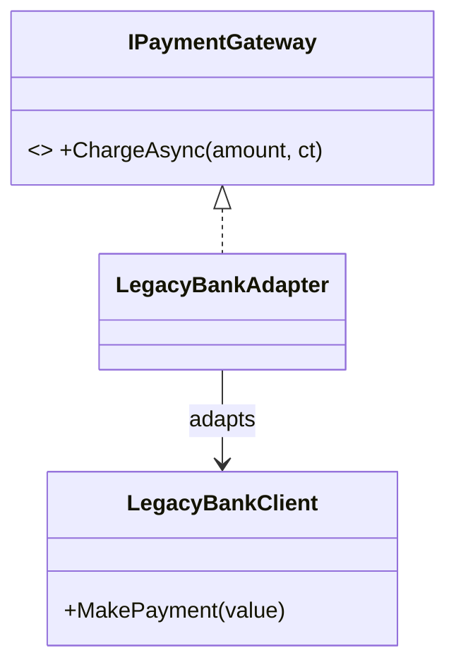
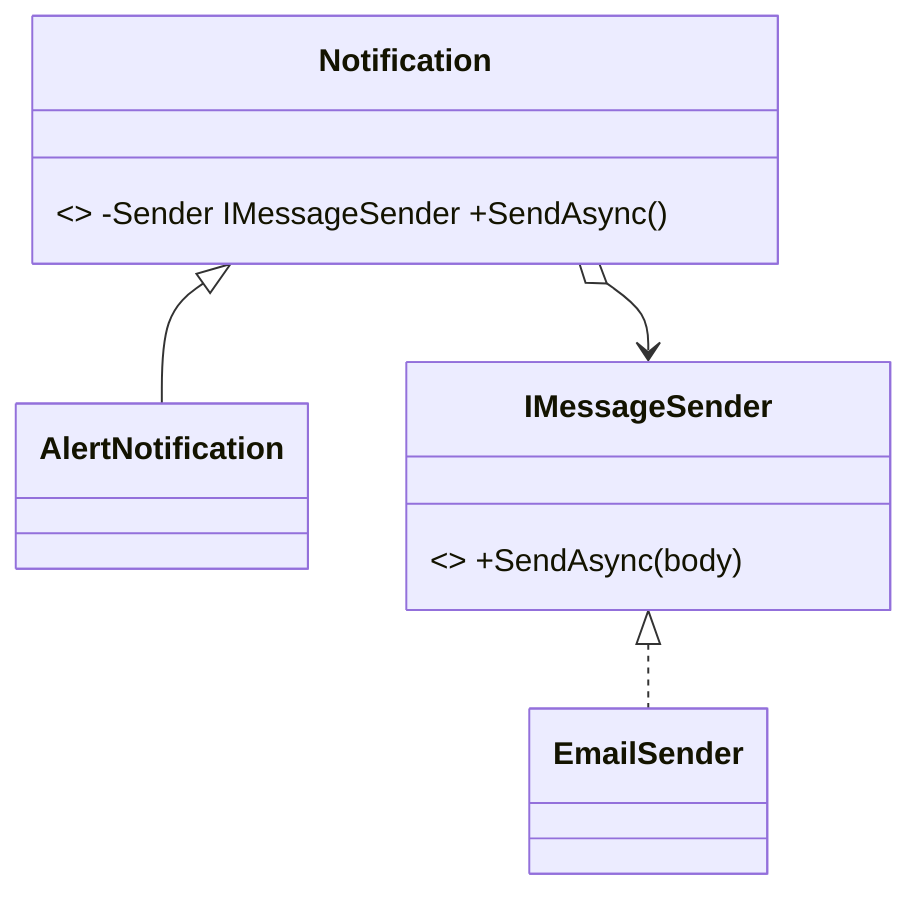
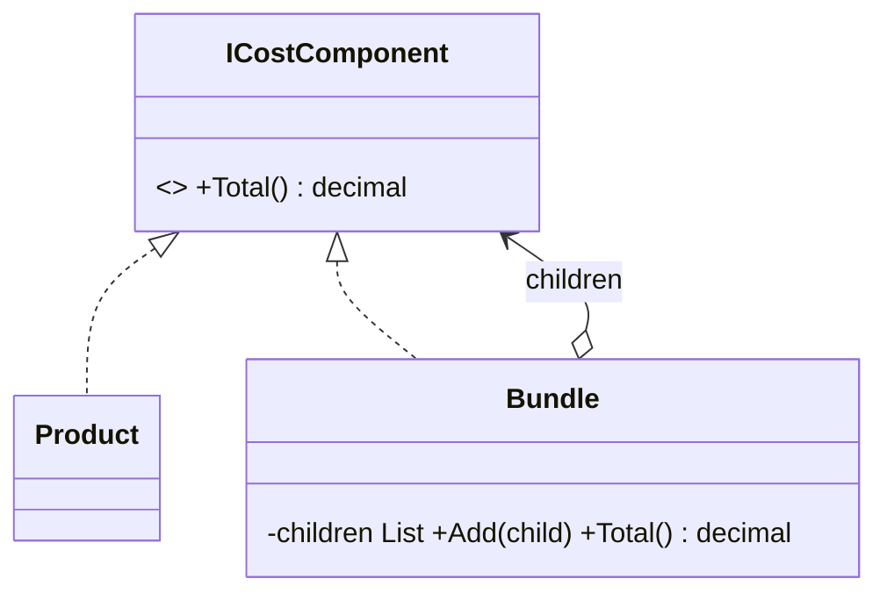
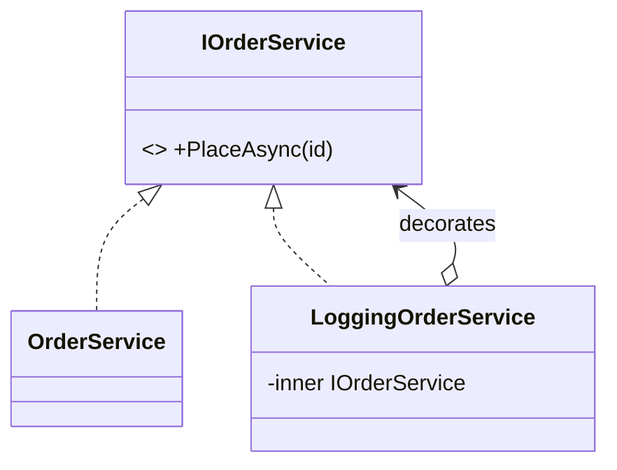
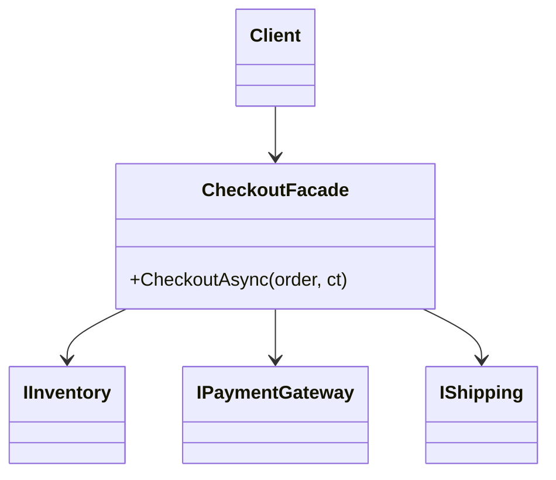
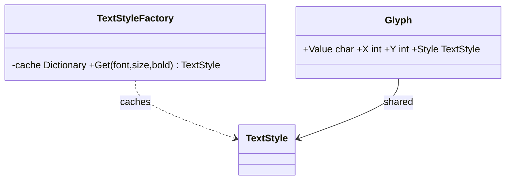
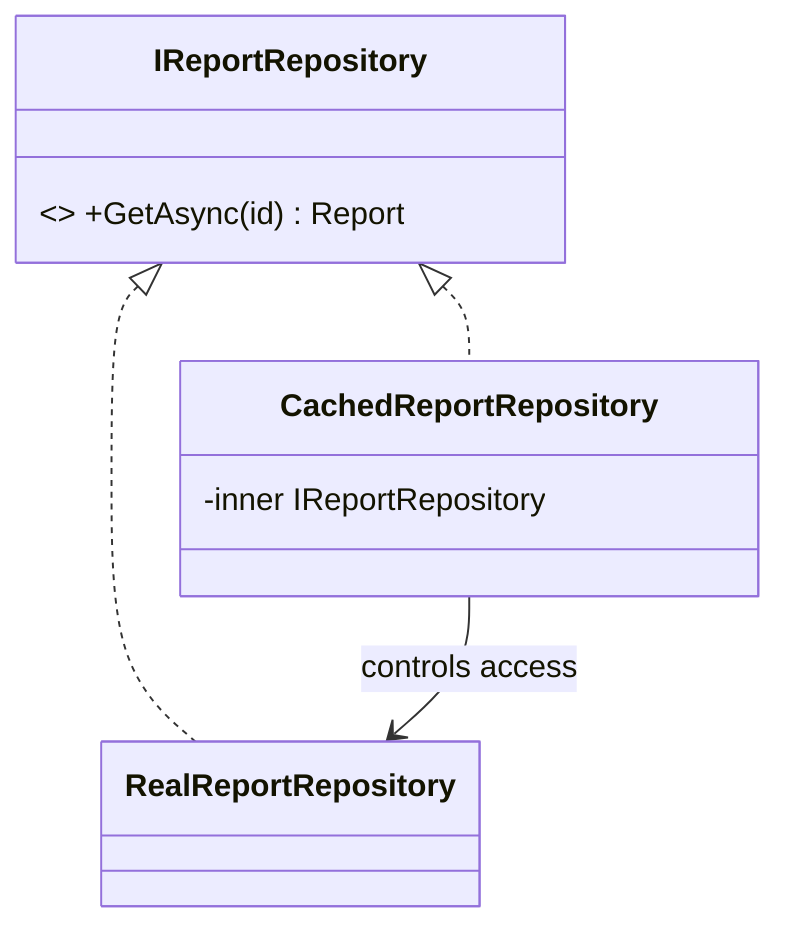

Sete padrões para compor classes e objetos sem criar acoplamento rígido.

## Adapter

Intenção. Converte a interface de um componente para outra esperada pelo cliente.

### Quando usar

Ao integrar APIs legadas, SDKs de terceiros ou modelos incompatíveis sem contaminar o domínio.

### Por que usar e benefícios

Protege o domínio; concentra tradução e tratamento de incompatibilidades; facilita substituição do fornecedor.

### Custos e cuidados

Adapters excessivos podem esconder integrações ruins e virar uma camada de mapeamento sem limites.

### Estrutura



### Exemplo em C#

```csharp
public interface IPaymentGateway { Task ChargeAsync(decimal amount, CancellationToken ct); }
public sealed class LegacyBankClient { public void MakePayment(double value) { } }
public sealed class LegacyBankAdapter(LegacyBankClient client) : IPaymentGateway {
    public Task ChargeAsync(decimal amount, CancellationToken ct) {
        ct.ThrowIfCancellationRequested();
        client.MakePayment(decimal.ToDouble(amount));
        return Task.CompletedTask;
    }
}
```

## Bridge

Intenção. Separa uma abstração de sua implementação para que ambas evoluam independentemente.

### Quando usar

Quando existem duas dimensões de variação, como tipo de mensagem e canal, formato e armazenamento, dispositivo e controle.

### Por que usar e benefícios

Evita explosão combinatória de subclasses; permite composição em runtime.

### Custos e cuidados

Aumenta abstrações e pode ser excessivo quando uma dimensão é estável.

### Estrutura



### Exemplo em C#

```csharp
public interface IMessageSender { Task SendAsync(string body); }
public sealed class EmailSender : IMessageSender { public Task SendAsync(string body) => Task.CompletedTask; }
public abstract class Notification(IMessageSender sender) {
    protected IMessageSender Sender { get; } = sender;
    public abstract Task SendAsync();
}
public sealed class AlertNotification(IMessageSender sender, string text) : Notification(sender) {
    public override Task SendAsync() => Sender.SendAsync($"ALERT: {text}");
}
```

## Composite

Intenção. Representa objetos individuais e composições de forma uniforme em uma estrutura de árvore.

### Quando usar

Para hierarquias parte-todo: menus, arquivos, organizações, expressões, componentes visuais.

### Por que usar e benefícios

Simplifica algoritmos recursivos; cliente trata folha e composição pela mesma interface.

### Custos e cuidados

Pode tornar difícil impor restrições sobre quais filhos cada composição aceita.

### Estrutura



### Exemplo em C#

```csharp
public interface ICostComponent { decimal Total(); }
public sealed record Product(decimal Price) : ICostComponent { public decimal Total() => Price; }
public sealed class Bundle : ICostComponent {
    private readonly List<ICostComponent> _children = [];
    public void Add(ICostComponent child) => _children.Add(child);
    public decimal Total() => _children.Sum(x => x.Total());
}
```

## Decorator

Intenção. Adiciona responsabilidades a um objeto por composição, mantendo a mesma interface.

### Quando usar

Quando comportamentos opcionais precisam ser combinados: cache, logging, retry, autorização, métricas.

### Por que usar e benefícios

Evita subclasses combinatórias; aplica responsabilidades de forma localizada e encadeável.

### Custos e cuidados

Muitos decorators dificultam depuração e ordem de execução; registre a cadeia de forma explícita.

### Estrutura



### Exemplo em C#

```csharp
public interface IOrderService { Task PlaceAsync(Guid id); }
public sealed class OrderService : IOrderService { public Task PlaceAsync(Guid id) => Task.CompletedTask; }
public sealed class LoggingOrderService(IOrderService inner, ILogger<LoggingOrderService> log) : IOrderService {
    public async Task PlaceAsync(Guid id) {
        log.LogInformation("Placing {OrderId}", id);
        await inner.PlaceAsync(id);
    }
}
```

## Facade

Intenção. Expõe uma interface simples para um subsistema complexo.

### Quando usar

Quando um caso de uso coordena vários serviços ou uma biblioteca possui detalhes que não devem escapar ao cliente.

### Por que usar e benefícios

Reduz acoplamento e conhecimento do cliente; cria uma API orientada ao caso de uso.

### Custos e cuidados

Pode virar um God Object se acumular regras e responsabilidades demais.

### Estrutura



### Exemplo em C#

```csharp
public sealed class CheckoutFacade(IInventory inventory, IPaymentGateway payment, IShipping shipping) {
    public async Task CheckoutAsync(Order order, CancellationToken ct) {
        await inventory.ReserveAsync(order.Items, ct);
        await payment.ChargeAsync(order.Total, ct);
        await shipping.ScheduleAsync(order, ct);
    }
}
```

## Flyweight

Intenção. Compartilha estado intrínseco imutável entre muitos objetos e mantém o estado contextual fora deles.

### Quando usar

Quando milhões de objetos repetem dados pesados, como estilos, metadados, ícones ou configurações.

### Por que usar e benefícios

Reduz memória e custo de criação; favorece cache de valores imutáveis.

### Custos e cuidados

Separar estado intrínseco e extrínseco aumenta complexidade; medir antes de aplicar.

### Estrutura



### Exemplo em C#

```csharp
public sealed record TextStyle(string Font, int Size, bool Bold);
public sealed class TextStyleFactory {
    private readonly Dictionary<(string,int,bool), TextStyle> _cache = [];
    public TextStyle Get(string font, int size, bool bold) =>
        _cache.TryGetValue((font,size,bold), out var style) ? style : _cache[(font,size,bold)] = new(font,size,bold);
}
public sealed record Glyph(char Value, int X, int Y, TextStyle Style);
```

## Proxy

Intenção. Controla o acesso a outro objeto mantendo a mesma interface.

### Quando usar

Para lazy loading, cache, autorização, acesso remoto, rate limiting ou proteção de recursos caros.

### Por que usar e benefícios

Adiciona políticas sem alterar o serviço real; pode atrasar inicialização e reduzir chamadas.

### Custos e cuidados

Pode esconder latência e falhas remotas; não confunda proxy com decorator orientado a responsabilidades.

### Estrutura



### Exemplo em C#

```csharp
public interface IReportRepository { Task<Report> GetAsync(Guid id); }
public sealed class CachedReportRepository(IReportRepository inner, IMemoryCache cache) : IReportRepository {
    public Task<Report> GetAsync(Guid id) => cache.GetOrCreateAsync($"report:{id}", _ => inner.GetAsync(id))!;
}
```
