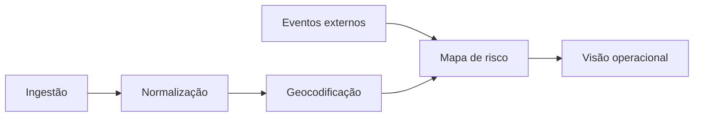

SOS Location é uma iniciativa de resposta humanitária focada no uso de tecnologia geoespacial para acelerar a tomada de decisão em cenários de crise. O projeto organiza camadas de dados complexas em uma interface operacional simples.

### Problema e solução

Em desastres, a fragmentação da informação custa vidas. A solução centraliza feeds de clima, áreas de risco e recursos disponíveis, utilizando processamento assíncrono para manter a atualização constante sem sobrecarregar o sistema.

### Arquitetura

Baseado em pipelines de eventos, o sistema separa a ingestão de dados (sensores, APIs externas) do processamento geoespacial e da camada de visualização em tempo real (WebSockets/Leaflet).

Modelo operacional simplificado: `risk = severity * exposure * vulnerability`.

### ADRs

*   Uso de GeoJSON como padrão de intercâmbio de dados.
*   Arquitetura orientada a eventos para garantir escalabilidade em picos de uso.
*   Isolamento de serviços de geolocalização para resiliência operacional.

### Roadmap

*   Integração com imagens de satélite para análise de inundação.
*   Expansão do modelo de predição de risco usando machine learning.
*   Suporte a offline-first para equipes de campo.
*   Publicações SOS Location: regras de negócio, fluxo e stack técnico.
