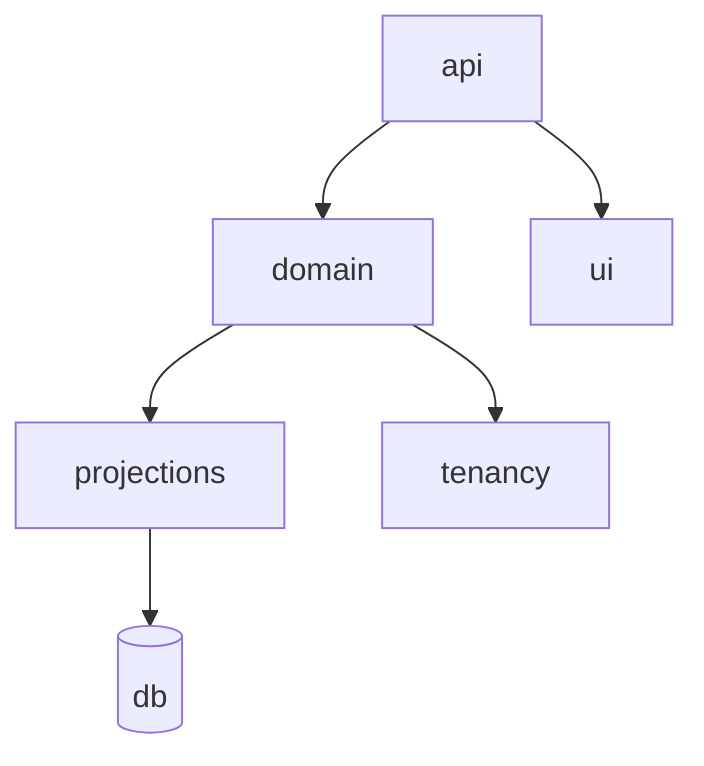

SplitCosts nasceu para resolver um problema simples sem cair em uma solução rasa: compartilhar despesas com contexto, histórico e separação clara entre grupos e usuários.

### Problema e solução

O desafio não era apenas registrar gastos. Era manter legibilidade do domínio, evitar acoplamento entre tenants e sustentar evolução de produto sem reescrever a base a cada ajuste de regra.

### Arquitetura

A solução segue uma linha mais pragmática: fronteiras explícitas no domínio, projeções simples para leitura e um backend pensado para crescer por contexto, não por páginas.

### Stack & Tecnologias

Mesmo sendo um produto mais tradicional, ele reforça os mesmos princípios que aparecem nos projetos com agentes: contratos claros, linguagem ubíqua e separação entre escrita e leitura.

### ADRs

*   Separar contexto de tenancy das regras de compartilhamento.
*   Usar projeções simples para telas operacionais e relatórios rápidos.

### Roadmap

*   Fechar modelo de recorrência e conciliação.
*   Aprimorar visibilidade de auditoria para alterações críticas.
